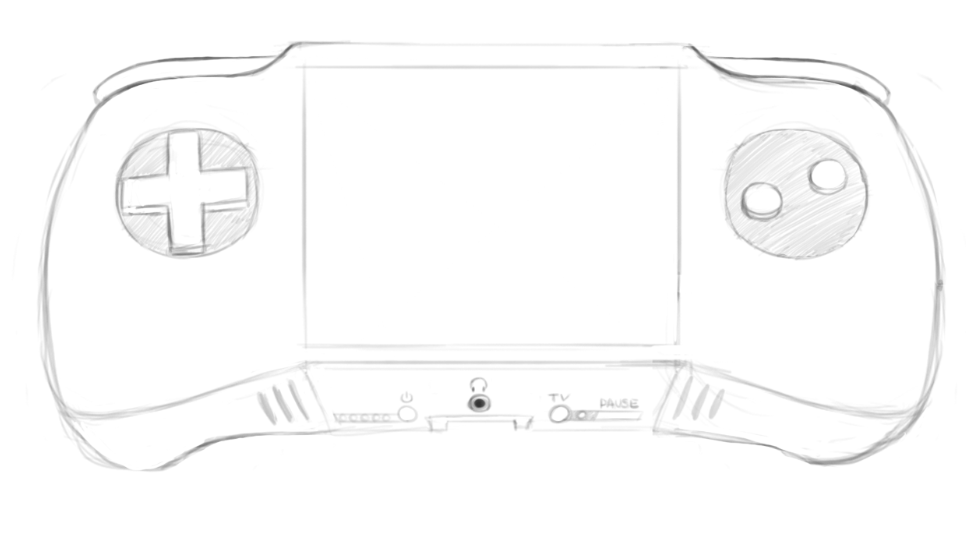

Manual do Desenvolvedor
=======================

O Nibble é um console portátil moderno com diversas limitações que incentivam a criatividade e inovação no design de jogos, fazendo com que o desenvolvimento seja simples e divertido.

Além disso, a principal caracterísica do Nibble é ter um baixo custo de desenvolvimento, tanto do ponto de vista monetário quanto tecnológico. Tudo o que é necessário para o desenvolvimento é distribuído não só com cada console, mas com cada jogo.

.. toctree::
    :maxdepth: 2

    características
    cartridges 
    game loop
    niblib
    hardware/index
